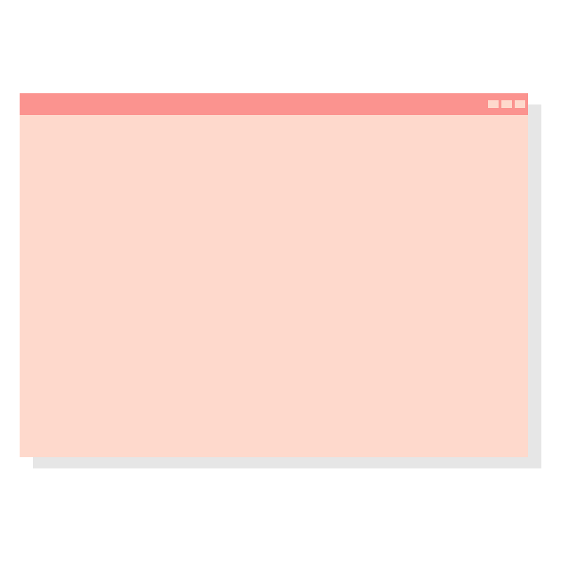

<table border="0">

<tr>

<td align="left" width="60%">
    

A little bit more about me...

- I'm a fullstack developer and a Computers Engineering student 👩‍💻

- I'm from Mexico 💚❤️

- **Web Development:** Javascript, React, Node JS

- **Game Development:** Unity, C#

- I’m currently working on a [Videogame App](https://github.com/SGrommelt/Videogames-App) that displays information about different videogames 🎮  
  
- **Fun fact:** I love videogames ❤️🎮  

</td>

<td align="right" width="50%">
    

</td>

</tr>
 
</table>

##

   

   

  
  
  
  
  
  
  
  
  
  
  
  
  
  
  
  
  
  
  
  
  
  
  
  
  
  
  
  
  
  
  
  
  
  
  
  
  
  
  
  
  
  
  
  
  

   

##

   

   

  
  
   

##
  

   

  

   

  

   

  

   

 

###

